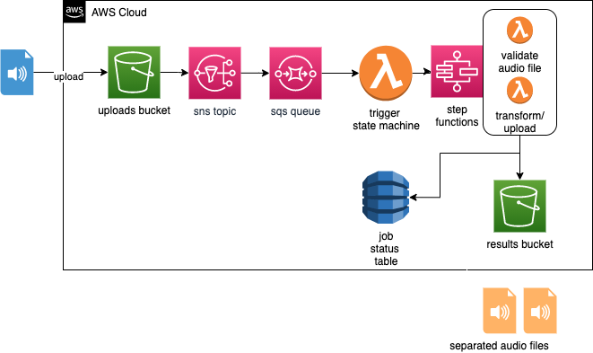

# terraform-spleeter-web-service
tf module to create spleeter web service on aws

## diagram

## prerequisites
*the following have been tested, other versions may work*

### software
- **terraform** >=0.13.0
- **docker** >=19.x.x
- **python** >=3.x.x

### services
- AWS Account
- Credentials to run terraform against your AWS account
- VPC to deploy resources into
